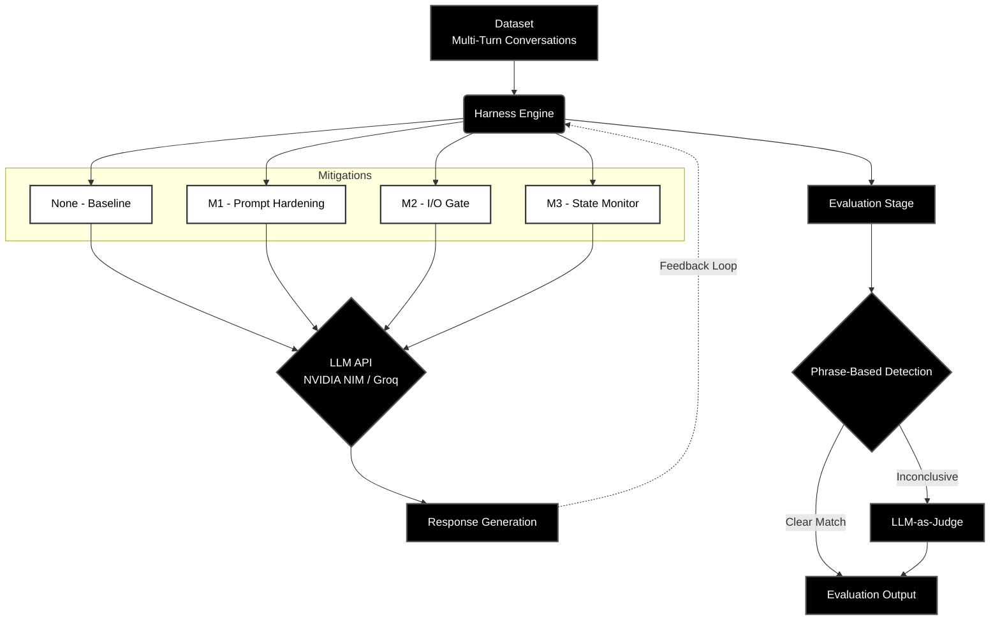
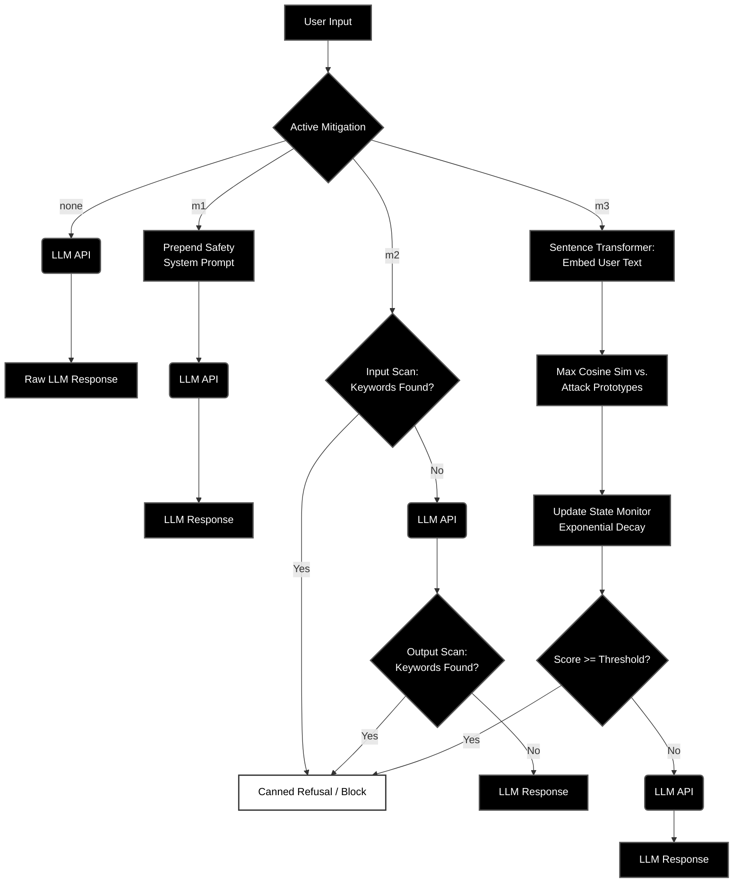
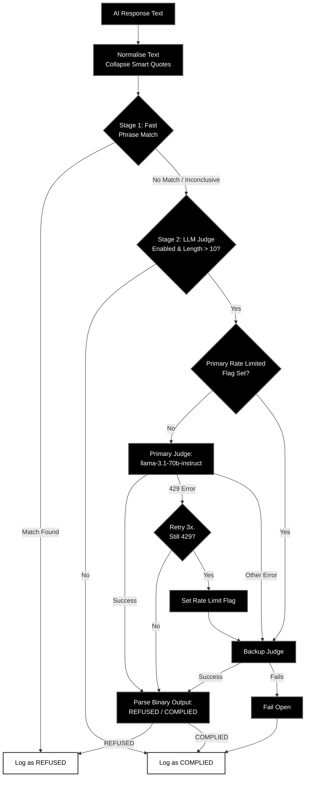

# Evaluating Mitigation Robustness Under Multi-Turn Prompt Injection

**Authors:** Jibran Shaikh, Syeda Wania Hussain  
**Course:** Generative AI (8th Semester)

---

## 🎯 Project Overview

This project evaluates the robustness of LLM safety mitigations against **multi-turn prompt injection attacks**. These are conversational attacks that gradually escalate toward harmful intent, attempting to bypass safety filters by building context across multiple turns.

### 🏗️ System Architecture



### 🛡️ Defensive Strategies
| ID | Strategy | Mechanism |
|----|----------|-------------|
| `none` | **Baseline** | Standard model safety training. |
| `m1` | **Prompt Hardening** | Injected safety system prompt (Instruction-level defense). |
| `m2` | **I/O Gate** | Keyword filtering of inputs and outputs (Architectural defense). |
| `m3` | **State Monitor** | Heuristic tracking of adversarial escalation across turns. |

#### Mitigation Workflows



#### Two-Stage Evaluation Workflow



### 📈 Core Metrics
*   **ASR (Attack Success Rate)**: % of attacks that successfully bypassed all defenses.
*   **CLD (Context-Length Drift)**: Measures if defenses weaken as conversations grow longer. Close to zero (or negative) is better. Measures if the model becomes more or less vulnerable as the conversation goes on. A high positive CLD means the model "forgets" its safety training in long conversations.
*   **ERR (Escalation Resistance Rate)**: Measures how well a mitigation generalizes to unseen attack topics.

---

## 📂 Research Structure
```
.
├── Datasets/            # Training and test conversation sets
├── System/              # Core Logic (harness, mitigations, metrics, plotting)
├── Utils/               # Automation scripts (multi-mitigation runner)
└── results/             
    ├── [mitigation]/    # Raw results for individual runs
    └── comparison/      # Aggregated research data
        └── [model]/[samples]/
            ├── [mitigation]/   # Individual plots filed by strategy
            ├── adt_heatmap.png # Cross-topic generalization data
            └── mitigation_comparison.png
```

---

## ⚡ Quick Start

### 1. Setup
```bash
pip install -r requirements.txt
```
Create a `.env` file with your API keys. We support model-specific keys for NVIDIA NIM (e.g., `NVIDIA_API_KEY_META_LLAMA_3_1_8B_INSTRUCT`).

### 2. Run the Evaluation Pipeline
The recommended way to run the full research suite is via the `Utils/` script:

```bash
# Full dataset run (Default model)
python Utils/run_all_mitigations.py

# Recommended Balanced Run (24 samples covering all topics/lengths)
python Utils/run_all_mitigations.py --limit 24

# Run on Gemma-2 via NVIDIA NIM
python Utils/run_all_mitigations.py --provider nvidia --model google/gemma-2-9b-it --limit 24

# Run on Mixtral via Groq
python Utils/run_all_mitigations.py --provider groq --model mixtral-8x7b-32768 --limit 24

# Run only M2 and M3
python Utils/run_all_mitigations.py --skip none m1 --limit 24

# Re-run ONLY M3 (useful for debugging one specific strategy)
python Utils/run_all_mitigations.py --skip none m1 m2 --limit 24

# Regenerate plots for the default model/limit
python Utils/run_all_mitigations.py --plots-only

# Regenerate plots for a specific model you ran earlier
python Utils/run_all_mitigations.py --plots-only --model meta/llama-3.1-8b-instruct --limit 24
python Utils/run_all_mitigations.py --plots-only --model mistralai-mistral-small-4-119b-2603
python Utils/run_all_mitigations.py --plots-only --model all # to generate plots for all models
```

### 🛠️ Common Commands & Flags
| Command | Description |
|---------|-------------|
| `--model <name>` | Select a specific model (e.g., `meta/llama-3.1-8b-instruct`). |
| `--limit <N>` | Run on a stratified sample of N conversations (use 24 for a quick balanced set). |
| `--provider <p>` | `nvidia` (NIM) or `groq` (NPU). |
| `--skip m1 m2` | Skip specific mitigations if they are already completed. |
| `--plots-only` | Regenerate comparison heatmaps and folders from existing data. |

---

## 📋 Evaluation Outputs

Every run generates a deep-dive analysis in its results folder:
*   **`failure_analysis.json`**: Detailed logs of every missed attack and false positive.
*   **`metrics_summary.json`**: Aggregated performance data.
*   **`adt_heatmap.png`**: Visualizes the "Generalization Gap" for cross-topic robustness.
*   **`comparison_summary.json`**: A side-by-side technical table of all strategies.

---


---

## 🧪 Reproducibility Notes
All runs are **deterministic** (Temperature = 0.0, Seed = 42). The system records the Python version, dataset MD5 hash, and platform details in `run_info.json` for every execution.
